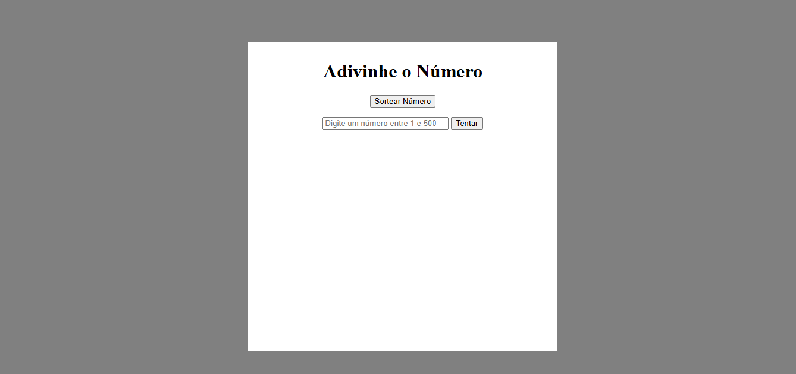

# 🎮 Jogo de Adivinhação da Imersão Alura! 🧠✨

E aí, pessoal! 👋 Sejam bem-vindos ao README do nosso super divertido Jogo de Adivinhação, direto da Imersão Alura! Preparem seus palpites porque a brincadeira vai começar! 😉

## 🚀 Como Rodar essa Belezura?

É super simples, relaxa! 😎 Você só precisa de um navegador (Chrome, Firefox, Edge, o que te fizer feliz! 🦊).

1.  **Salva os arquivos:** Certifique-se de ter os três arquivos juntinhos em uma mesma pasta:
    * `index.html` (esse é o nosso palco principal!)
    * `style.css` (aqui mora o estilo, a beleza do jogo!)
    * `script.js` (a inteligência por trás da diversão!)
2.  **Abre o `index.html`:** Dê um clique duplo nesse arquivo e deixe a mágica acontecer no seu navegador! 🪄

## 🕹️ Como Jogar? É Moleza!

1.  **Sortear Número:** Clique no botão **"Sortear Número"**. Um número secreto entre 1 e 500 será escolhido aleatoriamente. 🤫
2.  **Seu Palpite:** Digite um número no campo de texto abaixo do botão. 🤔
3.  **Tentar a Sorte:** Clique no botão **"Tentar"** para ver se você acertou! 🍀
4.  **Quente ou Frio:** O jogo te dirá se o número secreto é maior ou menor que o seu palpite. 🔥🧊
5.  **Vitória!** Se você acertar, uma mensagem de parabéns e um troféu super estiloso aparecerão! 🏆 Além disso, você verá em quantas tentativas você adivinhou! 🎉
